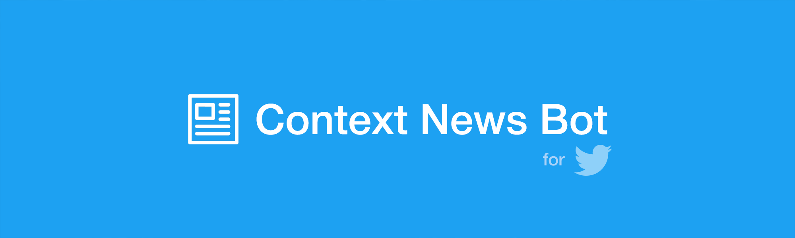
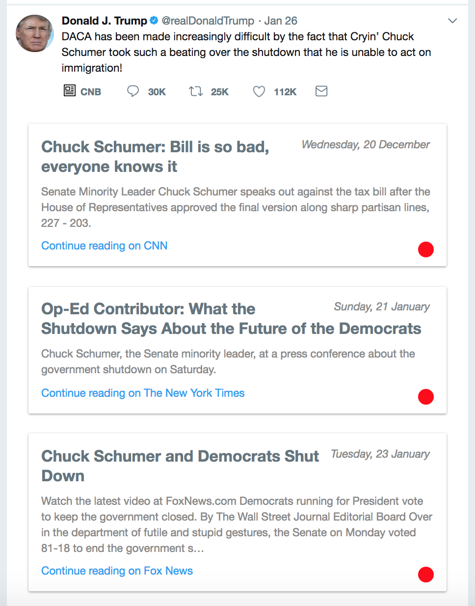
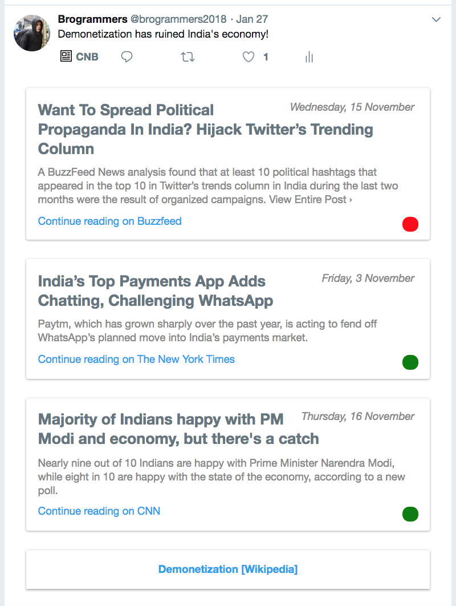

# Context News Bot

> Social media algorithms are built around engagement & likes, not perspective, and we aim to fix that with **Context News Bot**.



**tl;dr** Context News Bot is a Chrome extension that allows you to step out of your filter bubble by providing a diverse set of news articles and objective Wikipedia entries for tweets on your Twitter timeline. This repository contains the server-side code and works with the client-side [Chrome extension](https://github.com/SuyashLakhotia/ContextNewsBot-Client). Installation instructions can be found [here](#installation).


### Problems

- The inability of people to create an internal filter against their own bias has caused the proliferation of false (or somewhat false) information to plague modern society and is slowly leading us to a world with **only polarizing opinions**.

- Today's modern discovery algorithms trap us in personal **'filter bubbles'** by giving us content that agrees with our inherent biases regardless of whether these biases are grounded in reality.

### Solution

We built a machine learning based solution that allows users to fact-check content on Twitter and gain a broader perspective on news items and events. The service helps get rid of biases by understanding the semantics of the tweet's content and suggesting diverse news articles and Wikipedia entries that aim to provide a more rounded and objective perspective.

- Our natural language processing pipeline performs **entity and topic extraction** on the tweets to search for related news articles from reliable sources and discover relevant Wikipedia articles.

- We combine this information with **sentiment analysis** signals extracted from the tweet and the retrieved news articles to select articles that agree with the tweet as well as those that have a different perspective.

- The selected news articles are then **integrated into Twitter's user interface**, where the user can choose to read further about the issue at hand.

### Installation

After obtaining (and setting up) the required credentials for the [Twitter API](https://developer.twitter.com/), [News API](https://newsapi.org) & [Google Cloud Natural Language API](https://cloud.google.com/natural-language/), start the server by running:

```
$ pip install -r requirements.txt
$ python server.py
```

Next, clone and install the companion [Chrome extension](https://github.com/SuyashLakhotia/ContextNewsBot-Client) on your computer's Chrome browser. You should now see the Context News Bot button below the tweets on your Twitter timeline!

### Screenshots

#### Context News Button


#### Context Panel





### Team

1. [Suyash Lakhotia](https://github.com/SuyashLakhotia)
2. [Chaitanya Joshi](https://github.com/chaitjo)
3. [Nikhil Venkatesh](https://github.com/nikv96)
4. [Bobby Ranjan](https://github.com/bbbranjan)

---

> **NOTE:** Initially built for and during NUS Hack&Roll 2018. Won a Top 8 prize and Most Socially Useful Hack!
